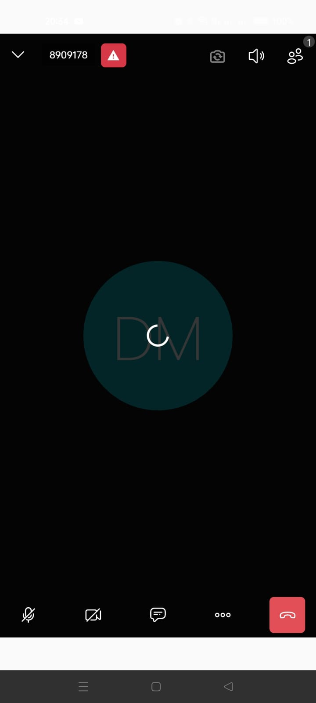

# Zoom Clone (Learning Project)

A **learning-focused clone inspired by Zoom**, built to explore **real-time communication**, **video conferencing**, and **distributed systems**.

> This project is **not affiliated with or endorsed by Zoom Video Communications**.  
> This project is for **educational and portfolio purposes only**.

---

##  Project Purpose

This project was created to understand the **core engineering challenges behind real-time video communication systems**, including signaling, peer connections, and session management.

The emphasis is on **how video conferencing works under the hood**, not on replicating Zoom’s UI or enterprise features.

---

## Key Features

-  Real-time video and audio calls
-  One-on-one and group meetings
-  Meeting room creation & joining
-  Basic authentication
-  Mute / unmute controls

---

##  Engineering Concepts Explored

- WebRTC fundamentals
- Signaling servers
- Real-time peer connections
- Network latency and bandwidth considerations
- Backend session coordination
- Security considerations in RTC systems

---

##  Tech Stack

### Frontend
- Flutter
- WebRTC integration
- Real-time UI state handling

### screenshots

  
  
  
  
  

### Backend
- Django / Node.js (signaling server)
- WebSockets
- STUN / TURN concepts
- Redis (for room/session coordination)

---

##  Project Structure

The repository uses a **clean, scalable layout** suitable for real-time systems.

